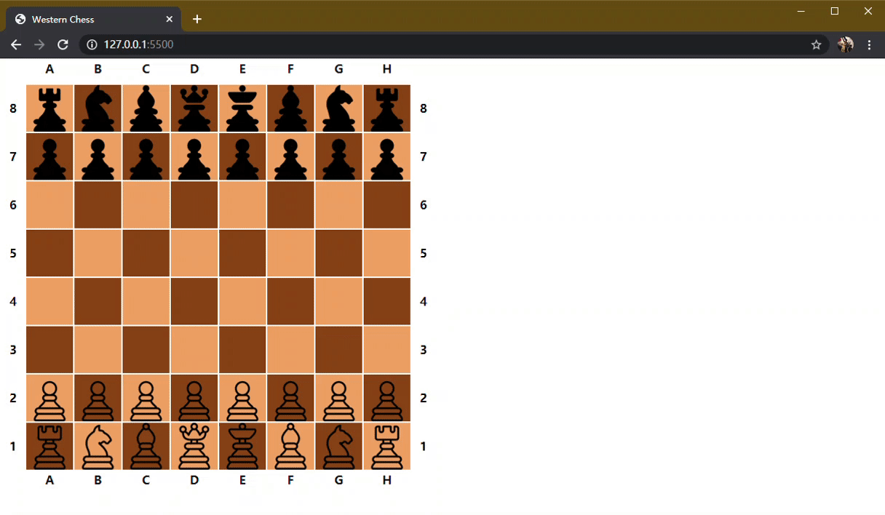

# saint-yellow/western-chess

## 前端习作 #01: 国际象棋, HTML+CSS+jQuery

### 在线演示
https://saint-yellow.github.io/western-chess

### 截图演示



### 目前已经完成的事
- 布局
- 单人对局
- 各类棋子的走法
- 简单的checkmate perception\
\
(注: 暂未支持士兵升格和王车易位)

### 以后可能会做的事
- 优化代码
- ~~胜负判定~~
- 更准确的checkmate perception
- 动画
- 基于TypeScript的React化
- 添加后端 (Flask/ASP.NET Core/...)
- 双人对局
- etc

### 启动
```
git clone https://github.com/saint-yellow/western-chess.git
cd western-chess
python -m http.server:6000
```
或者使用Visual Studio Code的Live Server插件启动该项目

### 更新
- fix: 黑白双方每回合只能移动自己的一只棋子 (2020-03-23)
- feature: 简单的胜负判定 (2020-03-25)
